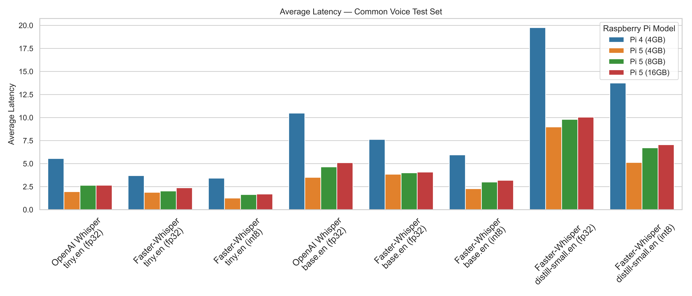
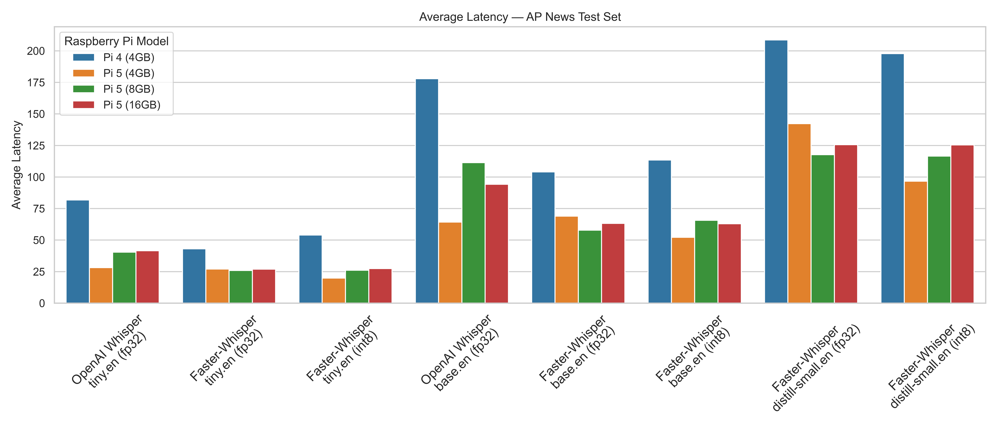

## How to use

All saved latency.txt files are in this format:
`audio_filename, latency_seconds`, 

such as

  ```
  common_voice_en_41928171.mp3,7.5914
  common_voice_en_41928476.mp3,5.6589
  common_voice_en_41940779.mp3,5.4359
  ...
  ```
First run the `Averge Calculation.py` to processes all latency.txt files

Then run `plot_Common.py` and `plot_AP.py` to obtain plots:

## Results




